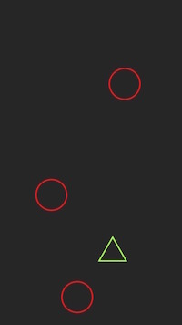

# february-seven
Don't hit the red circles.

Fun little iOS game I started on February 7, 2015 and launched in March 2016. 

## Screenshots

### Start Screen

### In Game

### Game Over

## License

Code is MIT.
Assets/* is CC0. 

## Installation

You can install the latest release from the app store: https://appsto.re/de/0r9tbb.i

## Changelog

### 1.1 (2)

- decreased points per obstacle to 1. also resetted all highscores.
- increased ship speed. more is always better.
- points are now displayed live while playing.
- version number is now displayed on the start screen. 

### 1.0 (1)

First public release.